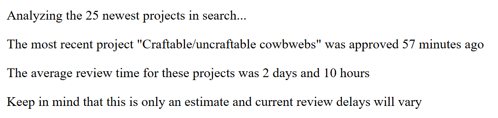

# Modrinth Delay Estimator
Makes some requests to the [Modrinth API](https://docs.modrinth.com/api/) to estimate what the current review delay is.

This is done by looking at the 25 newest projects in search, and comparing their `approved` and `queued` fields.

